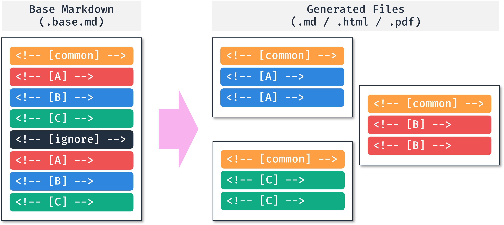

<!---------------------------->
<!-- multilingual suffix: en, fr, ko, ja -->
<!-- no suffix: en -->
<!---------------------------->

<div align="center" markdown>
   
</div>

<div align="center" markdown>

<!-- [en] -->
# [Multilingual Markdown Generator](https://mmg.ryul1206.dev/latest/)

This package provides a command-line interface to manage multilingual contents and generate i18n markdown from a single base file.
<!-- [fr] -->
# [Générateur de Markdown Multilingue](https://mmg.ryul1206.dev/latest/fr)

Ce package fournit une interface de ligne de commande pour gérer les contenus multilingues et générer des démarques i18n à partir d'un seul fichier de base.
<!-- [ko] -->
# [다국어 마크다운 생성기](https://mmg.ryul1206.dev/latest/ko)

이 패키지는 단일 기본 파일로부터 다국어 콘텐츠를 관리하고, i18n 마크 다운을 생성하는 명령 줄 인터페이스 (CLI)를 제공합니다.
<!-- [ja] -->
# [多言語マークダウンジェネレータ](https://mmg.ryul1206.dev/latest/ja)

このパッケージは、単一のデフォルトのファイルから多言語コンテンツを管理してi18nマークダウンを生成するコマンドラインインタフェース（CLI）を提供しています。
<!-- [common] -->

[](https://pypi.org/project/mmg/)


[](https://github.com/ryul1206/multilingual-markdown/blob/main/LICENSE)
<!-- [](https://pepy.tech/project/mmg) -->

🌏
<!-- [en] -->
English |
[**Français**](https://github.com/ryul1206/multilingual-markdown/blob/main/README.fr.md) |
[**한국어**](https://github.com/ryul1206/multilingual-markdown/blob/main/README.ko.md) |
[**日本語**](https://github.com/ryul1206/multilingual-markdown/blob/main/README.ja.md)

Available in Bash, Zsh, and Windows PowerShell.
<!-- [fr] -->
[**English**](https://github.com/ryul1206/multilingual-markdown/blob/main/README.md) |
Français |
[**한국어**](https://github.com/ryul1206/multilingual-markdown/blob/main/README.ko.md) |
[**日本語**](https://github.com/ryul1206/multilingual-markdown/blob/main/README.ja.md)

Disponible dans Bash, Zsh et Windows PowerShell.
<!-- [ko] -->
[**English**](https://github.com/ryul1206/multilingual-markdown/blob/main/README.md) |
[**Français**](https://github.com/ryul1206/multilingual-markdown/blob/main/README.fr.md) |
한국어 |
[**日本語**](https://github.com/ryul1206/multilingual-markdown/blob/main/README.ja.md)

Bash, Zsh, Windows PowerShell에서 사용할 수 있습니다.
<!-- [ja] -->
[**English**](https://github.com/ryul1206/multilingual-markdown/blob/main/README.md) |
[**Français**](https://github.com/ryul1206/multilingual-markdown/blob/main/README.fr.md) |
[**한국어**](https://github.com/ryul1206/multilingual-markdown/blob/main/README.ko.md) |
日本語

Bash, Zsh, WindowsPowerShellで使用できます。
<!-- [common] -->

</div>

---

<!-- [en] -->
**Table of Contents** ⚡
<!-- [ko] -->
**목차** ⚡
<!-- [ja] -->
**目次** ⚡
<!-- [fr] -->
**Table des matières** ⚡
<!-- [common] -->

<!-- [[ multilingual toc: level=2~3 no-emoji ]] -->

<!-- [en] -->
## Overview 🔎
<!-- [fr] -->
## Aperçu 🔎
<!-- [ko] -->
## 개요 🔎
<!-- [ja] -->
## 概要 🔎
<!-- [common] -->

<!-- [en] -->
### How It Works

By managing only one Base file, we can reduce the number of errors caused by missing or mismatched translations.
Additionally, thanks to editing in a single file, we can expect convenient translation with the auto-completion function of AI tools such as [Copilot](https://github.com/features/copilot).
<!-- [fr] -->
### Comment Ça Fonctionne

En gérant un seul fichier Base, nous pouvons réduire le nombre d'erreurs causées par des traductions manquantes ou incohérentes.
De plus, grâce à l'édition dans un seul fichier, nous pouvons nous attendre à une traduction pratique avec la fonction de complétion automatique des outils AI tels que [Copilot](https://github.com/features/copilot).
<!-- [ko] -->
### 작동 방식

Base 파일 하나만 관리하기 때문에, 콘텐츠 번역이 누락되거나 불일치되는 실수를 줄일 수 있습니다.
또한 단일 파일에서 편집하는 덕분에, [Copilot](https://github.com/features/copilot)과 같은 AI 도구의 자동 완성 기능으로 편리한 번역을 기대할 수 있습니다.
<!-- [ja] -->
### 作動方式

1 つの Base ファイルのみを管理することで、コンテンツの翻訳漏れや不一致によるエラーを減らすことができます。
また、単一ファイルで編集できるため、[Copilot](https://github.com/features/copilot) などの AI ツールの自動補完機能による便利な翻訳を期待できます。
<!-- [common] -->

Markdown:

<div align="center">
   
</div>

Jupyter Notebook:

<div align="center">
   
</div>

<!-- [en] -->
### Features

Supports the following features:

- **Markdown, Jupyter Notebook(`.ipynb`) as input formats**
- **As-is, HTML, PDF as ouput formats**
- Command-line interface for Bash, Zsh, Windows PowerShell
- Python API
- Recursive traversal mode with `-r` option (As-is, HTML, PDF are all supported)
- Batch processing mode with YAML file (Only `As-is` is supported)
- [IETF language tags](https://en.wikipedia.org/wiki/IETF_language_tag)
- UTF-8 encoding
- Automatic generation of table of contents with level and emoji options (Markdown and Jupyter Notebook are both supported)
- Base file validation (Check the number of tags of each language)
- Validation only mode for CI/CD (Disable file generation)
<!-- [ko] -->
### 특징

다음 기능을 지원합니다:

- **Markdown, Jupyter Notebook(`.ipynb`)을 입력 형식으로 사용**
- **As-is(있는 그대로), HTML, PDF 출력 형식**
- Bash, Zsh, Windows PowerShell용 명령줄 인터페이스
- 파이썬 API
- `-r` 옵션을 사용한 재귀 순회 모드 (As-is, HTML, PDF 모두 지원됨)
- YAML 파일을 사용한 일괄 처리 모드 (As-is만 지원)
- [IETF 언어 태그](https://ko.wikipedia.org/wiki/IETF_%EC%96%B8%EC%96%B4_%ED%83%9C%EA%B7%B8)
- UTF-8 인코딩
- 레벨 및 이모티콘 옵션이 포함된 목차 자동 생성 (Markdown 및 Jupyter Notebook 모두 지원)
- Base 파일 유효성 검사 (언어별 태그 개수 확인)
- CI/CD를 위한 유효성 검사 only 모드 (파일 생성 비활성화)
<!-- [ja] -->
### 特徴

次の機能をサポートします。

- **Markdown、Jupyter Notebook（`.ipynb`）を入力形式で使用する**
- **As-is(そのまま)、HTML、PDF出力形式**
- Bash、Zsh、Windows PowerShell用のコマンドラインインターフェイス
- Python API
- `-r`オプションを使用した再帰巡回モード（As-is、HTML、PDFの両方をサポート）
- YAMLファイルを使用したバッチモード（As-isのみサポート）
- [IETF言語タグ](https://ja.wikipedia.org/wiki/IETF%E8%A8%80%E8%AA%9E%E3%82%BF%E3%82%B0)
- UTF-8エンコーディング
- レベルと絵文字オプションを含む目次の自動生成（MarkdownとJupyter Notebookの両方をサポート）
- Baseファイルの検証(言語別のタグ数の確認)
- CI / CDのための検証のみモード（ファイル生成を無効にする）
<!-- [fr] -->
### Caractéristiques

Prend en charge les fonctionnalités suivantes :

- **Markdown, Jupyter Notebook(`.ipynb`) comme formats d'entrée**
- **Tel quel, HTML, PDF comme formats de sortie**
- Interface de ligne de commande pour Bash, Zsh, Windows PowerShell
- API Python
- Mode de parcours récursif avec l'option `-r` (tels quels, HTML, PDF sont tous pris en charge)
- Mode de traitement par lots avec fichier YAML (seul `tel quel` est pris en charge)
- [Étiquette d'identification de langues IETF](https://fr.wikipedia.org/wiki/%C3%89tiquette_d%27identification_de_langues_IETF)
- Encodage UTF-8
- Génération automatique de table des matières avec options de niveau et options de emoji (Markdown et Jupyter Notebook sont tous deux pris en charge)
- Validation du fichier de base (Vérifier le nombre de balises de chaque langue)
- Mode validation uniquement pour CI/CD (désactiver la génération de fichiers)
<!-- [common] -->

<!-- [en] -->
## Installation 📦
<!-- [fr] -->
## Installation 📦
<!-- [ko] -->
## 설치 📦
<!-- [ja] -->
## 設置 📦
<!-- [common] -->

### Linux

```sh
pip3 install mmg
```

### macOS

```sh
pip3 install mmg
```

<!-- [en] -->
If you have any issues with [WeasyPrint](https://doc.courtbouillon.org/weasyprint/stable/first_steps.html#macos), install it with the following command. WeasyPrint is only used to create PDFs.
<!-- [fr] -->
Si vous rencontrez des problèmes avec [WeasyPrint](https://doc.courtbouillon.org/weasyprint/stable/first_steps.html#macos), installez-le avec la commande suivante. WeasyPrint est uniquement utilisé pour créer des PDF.
<!-- [ko] -->
만약 [WeasyPrint](https://doc.courtbouillon.org/weasyprint/stable/first_steps.html#macos)와 관련된 문제가 발생한다면, 아래 명령어으로 설치해주세요. WeasyPrint는 PDF를 생성할 때에만 사용됩니다.
<!-- [ja] -->
[WeasyPrint](https://doc.courtbouillon.org/weasyprint/stable/first_steps.html#macos)で問題が発生した場合は、次のコマンドでインストールしてください。WeasyPrintはPDFの作成にのみ使用されます。
<!-- [common] -->

```sh
brew install weasyprint
```

### Windows

<!-- [en] -->
1. MMG uses [WeasyPrint](https://doc.courtbouillon.org/weasyprint/stable/first_steps.html#windows) to create PDFs. WeasyPrint requires the GTK library, so download and run the latest [GTK3 installer](https://github.com/tschoonj/GTK-for-Windows-Runtime-Environment-Installer/releases). **If you are not interested in creating PDFs, you can skip this step.** Other features of MMG are available without GTK.
2. Install MMG using Pip.
<!-- [fr] -->
1. MMG utilise [WeasyPrint](https://doc.courtbouillon.org/weasyprint/stable/first_steps.html#windows) pour créer des PDF. WeasyPrint nécessite la bibliothèque GTK, alors téléchargez et exécutez le dernier [installateur GTK3](https://github.com/tschoonj/GTK-for-Windows-Runtime-Environment-Installer/releases). **Si vous n'êtes pas intéressé par la création de PDF, vous pouvez ignorer cette étape.** Les autres fonctionnalités de MMG sont disponibles sans GTK.
2. Installez MMG à l'aide de Pip.
<!-- [ko] -->
1. MMG는 [WeasyPrint](https://doc.courtbouillon.org/weasyprint/stable/first_steps.html#windows)를 사용하여 PDF를 생성합니다. WeasyPrint는 GTK 라이브러리가 있어야 작동하므로, 최신 [GTK3 설치 파일](https://github.com/tschoonj/GTK-for-Windows-Runtime-Environment-Installer/releases)을 다운로드하고 실행하세요. **PDF 생성 기능을 사용하지 않는다면 이 단계을 건너뛰어도 됩니다.** GTK가 없더라도 MMG의 다른 기능들은 정상적으로 쓸 수 있습니다.
2. Pip를 사용하여 MMG를 설치합니다.
<!-- [ja] -->
1. MMGは[WeasyPrint](https://doc.courtbouillon.org/weasyprint/stable/first_steps.html#windows)を使用してPDFを作成します。WeasyPrintはGTKライブラリが必要なので、最新の[GTK3インストーラー](https://github.com/tschoonj/GTK-for-Windows-Runtime-Environment-Installer/releases)をダウンロードして実行します。**PDFを作成することに興味がない場合は、このステップをスキップできます。** GTKがなくても、MMGの他の機能は使用できます。
2. Pipを使用してMMGをインストールします。
<!-- [common] -->

    ```sh
    pip3 install mmg
    ```

<!-- [en] -->
## How to Use 💡

Please refer to the [documentation](https://mmg.ryul1206.dev/latest/) for detailed usage and examples.
<!-- [fr] -->
## Mode d'emploi 💡

Veuillez vous référer à la [documentation](https://mmg.ryul1206.dev/latest/fr/) pour plus de détails sur l'utilisation et des exemples.
<!-- [ko] -->
## 사용법 💡

자세한 사용법과 예제는 [문서](https://mmg.ryul1206.dev/latest/ko/)를 참고해주세요.
<!-- [ja] -->
## 使用方法 💡

詳細な使用方法と例は、[ドキュメント](https://mmg.ryul1206.dev/latest/ja/)を参照してください。
<!-- [common] -->

```sh
$ mmg --help
Usage: mmg [OPTIONS] [FILE_NAMES]...

  FILE_NAMES: Base file names to convert. `*.base.md` or `*.base.ipynb` are
  available.

  Here are some examples:

      mmg *.base.md

      mmg *.base.ipynb

      mmg *.base.md *.base.ipynb -o pdf --css github-dark

      mmg --recursive

      mmg --recursive --validation-only

      mmg --batch mmg.yml

Options:
  -r, --recursive                 This will search all subfolders based on
                                  current directory.
  -b, --batch FILE                YAML file path for batch conversion.
                                  (Default: None)
  -o, --output-format [as-is|html|pdf]
                                  Output format. (Default: as-is)
  --css TEXT                      CSS file path or preset('github-
                                  light'/'github-dark'). Only for the HTML/PDF
                                  output. (Default: github-light)
  -y, --yes                       This will confirm the conversion without
                                  asking. (Default: False)
  -s, --skip-validation           Skip the health check. (Default: False)
  --validation-only               Only check the health. (Default: False)
  -v, --verbose                   Verbosity level from 0 to 2. --verbose:1,
                                  -v:1, -vv:2 (Default: 0)
  --version                       Show the current version.
  --help                          Show this message and exit.
```

<!-- [en] -->
## Troubleshooting 💊

Please refer to the [troubleshooting](https://mmg.ryul1206.dev/latest/misc/troubleshooting/) page on the website.
<!-- [fr] -->
## Dépannage 💊

Veuillez vous référer à la page [dépannage](https://mmg.ryul1206.dev/latest/fr/misc/troubleshooting/) sur le site web.
<!-- [ko] -->
## 문제 해결 💊

[문제 해결](https://mmg.ryul1206.dev/latest/ko/misc/troubleshooting/) 페이지를 참고해주세요.
<!-- [ja] -->
## トラブルシューティング 💊

[トラブルシューティング](https://mmg.ryul1206.dev/latest/ja/misc/troubleshooting/)ページを参照してください。
<!-- [common] -->

## Changelog 📝

[CHANGELOG.md](https://github.com/ryul1206/multilingual-markdown/blob/develop/CHANGELOG.md)

<!-- [en] -->
## Contributors 🤝
<!-- [fr] -->
## Contributeurs 🤝
<!-- [ko] -->
## 기여하신 분들 🤝
<!-- [ja] -->
## 貢献された方々 🤝
<!-- [common] -->

<a href="https://github.com/ryul1206/multilingual-markdown/graphs/contributors">
  
</a>

<!-- [en] -->
Made with [contrib.rocks](https://contrib.rocks).

If you are interested in how to contribute, please refer to the [contribution guide](https://mmg.ryul1206.dev/latest/contributing/).
<!-- [fr] -->
Réalisé avec [contrib.rocks](https://contrib.rocks).

Si vous êtes intéressé par la façon de contribuer, veuillez vous référer au [guide de contribution](https://mmg.ryul1206.dev/latest/fr/contributing/).
<!-- [ko] -->
[contrib.rocks](https://contrib.rocks)로 만들었습니다.

기여 방법에 관심이 있으시다면, [기여 가이드](https://mmg.ryul1206.dev/latest/ko/contributing/)를 참고해주세요.
<!-- [ja] -->
[contrib.rocks](https://contrib.rocks)で作りました。

貢献方法に興味がある方は、[貢献ガイド](https://mmg.ryul1206.dev/latest/ja/contributing/)を参照してください。
<!-- [common] -->
