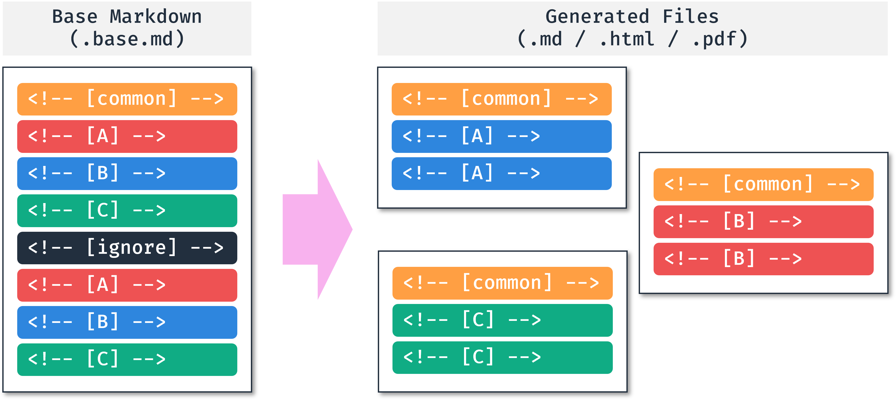
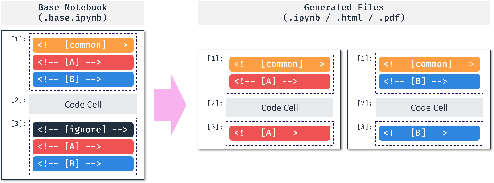

<div align="center" markdown>
   
</div>

<div align="center" markdown>

# [Générateur de Markdown Multilingue](https://mmg.ryul1206.dev/latest/fr)

Ce package fournit une interface de ligne de commande pour gérer les contenus multilingues et générer des démarques i18n à partir d'un seul fichier de base.

[](https://pypi.org/project/mmg/)


[](https://github.com/ryul1206/multilingual-markdown/blob/main/LICENSE)

🌏
[**English**](https://github.com/ryul1206/multilingual-markdown/blob/main/README.md) |
Français |
[**한국어**](https://github.com/ryul1206/multilingual-markdown/blob/main/README.ko.md) |
[**日本語**](https://github.com/ryul1206/multilingual-markdown/blob/main/README.ja.md)

Disponible dans Bash, Zsh et Windows PowerShell.

</div>

---

**Table des matières** ⚡

1. [Aperçu](#aperçu-)
    1. [Comment Ça Fonctionne](#comment-ça-fonctionne)
    1. [Caractéristiques](#caractéristiques)
1. [Installation](#installation-)
    1. [Linux](#linux)
    1. [macOS](#macos)
    1. [Windows](#windows)
1. [Mode d'emploi](#mode-demploi-)
1. [Dépannage](#dépannage-)
1. [Changelog](#changelog-)
1. [Contributeurs](#contributeurs-)

## Aperçu 🔎

### Comment Ça Fonctionne

En gérant un seul fichier Base, nous pouvons réduire le nombre d'erreurs causées par des traductions manquantes ou incohérentes.
De plus, grâce à l'édition dans un seul fichier, nous pouvons nous attendre à une traduction pratique avec la fonction de complétion automatique des outils AI tels que [Copilot](https://github.com/features/copilot).

Markdown:

<div align="center">
   
</div>

Jupyter Notebook:

<div align="center">
   
</div>

### Caractéristiques

Prend en charge les fonctionnalités suivantes :

- **Markdown, Jupyter Notebook(`.ipynb`) comme formats d'entrée**
- **Tel quel, HTML, PDF comme formats de sortie**
- Interface de ligne de commande pour Bash, Zsh, Windows PowerShell
- API Python
- Mode de parcours récursif avec l'option `-r` (tels quels, HTML, PDF sont tous pris en charge)
- Mode de traitement par lots avec fichier YAML (seul `tel quel` est pris en charge)
- [Étiquette d'identification de langues IETF](https://fr.wikipedia.org/wiki/%C3%89tiquette_d%27identification_de_langues_IETF)
- Encodage UTF-8
- Génération automatique de table des matières avec options de niveau et options de emoji (Markdown et Jupyter Notebook sont tous deux pris en charge)
- Validation du fichier de base (Vérifier le nombre de balises de chaque langue)
- Mode validation uniquement pour CI/CD (désactiver la génération de fichiers)

## Installation 📦

### Linux

```sh
pip3 install mmg
```

### macOS

```sh
pip3 install mmg
```

Si vous rencontrez des problèmes avec [WeasyPrint](https://doc.courtbouillon.org/weasyprint/stable/first_steps.html#macos), installez-le avec la commande suivante. WeasyPrint est uniquement utilisé pour créer des PDF.

```sh
brew install weasyprint
```

### Windows

1. MMG utilise [WeasyPrint](https://doc.courtbouillon.org/weasyprint/stable/first_steps.html#windows) pour créer des PDF. WeasyPrint nécessite la bibliothèque GTK, alors téléchargez et exécutez le dernier [installateur GTK3](https://github.com/tschoonj/GTK-for-Windows-Runtime-Environment-Installer/releases). **Si vous n'êtes pas intéressé par la création de PDF, vous pouvez ignorer cette étape.** Les autres fonctionnalités de MMG sont disponibles sans GTK.
2. Installez MMG à l'aide de Pip.

    ```sh
    pip3 install mmg
    ```

## Mode d'emploi 💡

Veuillez vous référer à la [documentation](https://mmg.ryul1206.dev/latest/fr/) pour plus de détails sur l'utilisation et des exemples.

```sh
$ mmg --help
Usage: mmg [OPTIONS] [FILE_NAMES]...

  FILE_NAMES: Base file names to convert. `*.base.md` or `*.base.ipynb` are
  available.

  Here are some examples:

      mmg *.base.md

      mmg *.base.ipynb

      mmg *.base.md *.base.ipynb -o pdf --css github-dark

      mmg --recursive

      mmg --recursive --validation-only

      mmg --batch mmg.yml

Options:
  -r, --recursive                 This will search all subfolders based on
                                  current directory.
  -b, --batch FILE                YAML file path for batch conversion.
                                  (Default: None)
  -o, --output-format [as-is|html|pdf]
                                  Output format. (Default: as-is)
  --css TEXT                      CSS file path or preset('github-
                                  light'/'github-dark'). Only for the HTML/PDF
                                  output. (Default: github-light)
  -y, --yes                       This will confirm the conversion without
                                  asking. (Default: False)
  -s, --skip-validation           Skip the health check. (Default: False)
  --validation-only               Only check the health. (Default: False)
  -v, --verbose                   Verbosity level from 0 to 2. --verbose:1,
                                  -v:1, -vv:2 (Default: 0)
  --version                       Show the current version.
  --help                          Show this message and exit.
```

## Dépannage 💊

Veuillez vous référer à la page [dépannage](https://mmg.ryul1206.dev/latest/fr/misc/troubleshooting/) sur le site web.

## Changelog 📝

[CHANGELOG.md](https://github.com/ryul1206/multilingual-markdown/blob/develop/CHANGELOG.md)

## Contributeurs 🤝

<a href="https://github.com/ryul1206/multilingual-markdown/graphs/contributors">
  
</a>

Réalisé avec [contrib.rocks](https://contrib.rocks).

Si vous êtes intéressé par la façon de contribuer, veuillez vous référer au [guide de contribution](https://mmg.ryul1206.dev/latest/fr/contributing/).