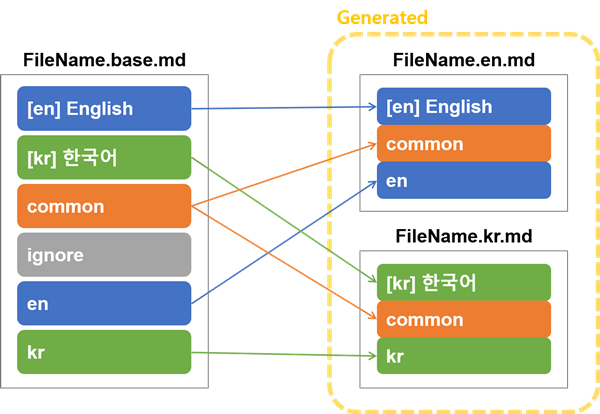

# Multilingual Markdown Generator

This package provides a command-line interface to manage multilingual contents and generate i18n markdown from a single base file.

[](https://github.com/ryul1206/multilingual-markdown)


[](https://www.codefactor.io/repository/github/ryul1206/multilingual-markdown)

🚀 **version 1.0.3**
🌏
English |
[**Français**](https://github.com/ryul1206/multilingual-markdown/blob/master/README.fr.md) |
[**한국어**](https://github.com/ryul1206/multilingual-markdown/blob/master/README.kr.md) |
[**日本語**](https://github.com/ryul1206/multilingual-markdown/blob/master/README.jp.md)

Available in Bash, Zsh, and Windows PowerShell.

---

**Table of Contents** ⚡

1. [Overview ](#Overview-)
    1. [How It Works](#How-It-Works)
    1. [Features](#Features)
1. [Install](#Install)
    1. [How to Fix a "Command Not Found" Error](#How-to-Fix-a-Command-Not-Found-Error)
1. [Update](#Update)
1. [Uninstall](#Uninstall)
1. [How to Use](#How-to-Use)
    1. [(0) Make a Base Markdown File](#0-Make-a-Base-Markdown-File)
    1. [(1) File Designation](#1-File-Designation)
    1. [(2) Recursive Option](#2-Recursive-Option)
    1. [(3) Base File Validation](#3-Base-File-Validation)
    1. [(4) More explanations](#4-More-explanations)
1. [Command Tags](#Command-Tags)
    1. [Headers](#Headers)
    1. [Badges](#Badges)
    1. [Main Text](#Main-Text)
1. [Contribution](#Contribution)
    1. [How to build locally for development](#How-to-build-locally-for-development)
    1. [Changelog](#Changelog)
    1. [Contributors](#Contributors)

## Overview 🔎

### How It Works


### Features

- Auto suffix to file name
  - [IETF language tags](https://en.wikipedia.org/wiki/IETF_language_tag) are also available.
  - Remove suffix option for one main language
- UTF-8 encoding. So this *would* support almost all languages. :) 🍷
- Auto table of contents
    - Table of contents level options
    - Table of contents emoji **on-off** options

## Install

```sh
pip3 install mmg --user
```

Now when you open a new terminal you can use the new command `mmg`.

```sh
$ mmg --help
mmg [OPTIONS] [FILENAMES]...

Options:
  --version                 Show the current version.
  -r, --recursive           This recursive option searches all subfolders
                            based on current directory and converts all base
                            files.
  -y, --yes                 Confirm the action without prompting
  -c, --check / -s, --skip  Check the number of language tags of each file
                            (defualt: --check)
  -v, --verbose             For example, -v:1, -vv:2, -vvv:3  [x>=0]
  --help                    Show this message and exit.
```

### How to Fix a "Command Not Found" Error

**Ubuntu Bash/Zsh**

- Cause: This error occurs if the variable `PATH` does not contain the path `$HOME/.local/bin` where the `mmg` command is installed.
- Solution: Open `~/.bashrc` or `~/.zshrc` file and add `$HOME/.local/bin` to `PATH`.
    ```
    export PATH="$HOME/.local/bin:$PATH"
    ```

**Windows PowerShell**

You can solve the problem by creating the PS modules in the order described below.

1. You can check the PSModule paths by using the `$env:PSModulePath` command in PowerShell. Paste the PSmmg folder of this repository into one of the PSModule paths. For example, `C:\Program Files\WindowsPowerShell\Modules\PSmmg\PSmmg.psm1` should exist.
2. Run PowerShell in administrator mode and change the execution policy.
    ```
    Set-ExecutionPolicy RemoteSigned
    ```
3. Now restart PowerShell and you can use the `mmg` command.

**OS Agnostic Alternative**

```
python -m mmgcli [options]
```

## Update

```sh
pip3 install mmg --upgrade --user
```

## Uninstall

```sh
pip3 uninstall mmg
```

## How to Use

### (0) Make a Base Markdown File

Make `{something}.base.md` files. See [README.base.md](README.base.md) and [example.base.md](example/example.base.md) for examples, and [Command Tags](#Command-Tags) for rules.

**(Note) A wrong format of base-file will break generated style.**

### (1) File Designation

Enter the `*.base.md` files that you want to create in multiple languages as arguments to the `mmg` command.

```sh
mmg FileName.base.md
```

Multiple arguments are separated by spaces.

```sh
mmg Foo.base.md Bar.base.md Baz.base.md
```

### (2) Recursive Option

If you want to convert all base files in the current directory and subdirectories, use the `--recursive` or `-r` option.
The recursive option searches all subfolders based on where the command is entered.
You cannot specify a folder as an argument yet.

```sh
mmg --recursive
```

### (3) Base File Validation

When your file may have a problem.
(Normal is shown in green and abnormal in red.)

- Verbosity 0
    ```text
    $ mmg -r
    ----------------------
    ✅ .\README.base.md
    ❌ .\example\example.base.md
    ----------------------
    => 2 base markdowns were found.
        Your verbosity is 0. Try the `--verbose` option for more details.
    Do you want to convert these files? [y/N]
    ```
- Verbosity 1 (`--verbose`)
    ```text
    $ mmg -r -v
    ----------------------
    ✅ .\README.base.md
        Tag count: {'en': 37, 'fr': 37, 'kr': 37}
    ❌ .\example\example.base.md
        4 language(s) not translated.
        Tag count: {'en-US': 4, 'fr-FR': 4, 'ko-KR': 5, 'ja-JP': 4, '<Unknown>': 1}
    ----------------------
    => 2 base markdowns were found.
    Do you want to convert these files? [y/N]
    ```
- Verbosity 2
    ```text
    $ mmg -r -vv
    ----------------------
    ✅ .\README.base.md
        Tag count: {'en': 37, 'fr': 37, 'kr': 37}
    ❌ .\example\example.base.md
        4 language(s) not translated.
        Tag count: {'en-US': 4, 'fr-FR': 4, 'ko-KR': 5, 'ja-JP': 4, '<Unknown>': 1}
            Line 28: This language reappeared before all languages appeared once.
            Line 36: A common area appeared before all languages come out.
            Line 57: Unknown suffix detected.
            Line 59: This language reappeared before all languages appeared once.
    ----------------------
    => 2 base markdowns were found.
    Do you want to convert these files? [y/N]
    ```

When your files are ok.

```text
$ mmg -r --verbose
----------------------
✅ .\README.base.md
    Tag count: {'en': 37, 'fr': 37, 'kr': 37}
✅ .\example\example.base.md
    Tag count: {'en-US': 4, 'fr-FR': 4, 'ko-KR': 4, 'ja-JP': 4}i
----------------------
=> 2 base markdowns were found.
    Your verbosity is 0. Try the `--verbose` option for more details.
Do you want to convert these files? [y/N]
```

### (4) More explanations

- You can find the `{something}.{suffix}.md` files in the same directory. For example:
    - By default: `{something}.en.md`, `{something}.kr.md`, `{something}.es.md`, ...
    - When no-suffix option on `en`: `{something}.md`, `{something}.kr.md`, `{something}.es.md`, ...
- Since this generator overwrites the auto-generated files each time, you do not have to delete them every time when you modify the `{something}.base.md`. Just run step 2 again.

## Command Tags

### Headers

Headers must be declared before the body begins.

1. **Suffix Declaration**

    Declare the language you want to use. The following example declares `en` and `kr` and others as keywords. These keywords are used as suffixes.

    ```markdown
    <!-- multilingual suffix: en, kr, fr, es, jp, cn -->
    ```

1. **Hidden Suffix** (Optional)

    The `no suffix` option can prevent the suffix from being appended when creating the file. In other words, setting `no suffix` to `en` will generate `FileName.md` instead of `FileName.en.md`. This is useful because the main `README` in **GitHub** is not recognized when it has a suffix.

    ```markdown
    <!-- no suffix: en -->
    ```

### Badges

[](https://github.com/ryul1206/multilingual-markdown)
[](https://github.com/ryul1206/multilingual-markdown)
[](https://github.com/ryul1206/multilingual-markdown)
[](https://github.com/ryul1206/multilingual-markdown)
...

```markdown
[](https://github.com/ryul1206/multilingual-markdown)
```

### Main Text

Everything that the parser reads after the tag below is recognized as the main text. (So you have to write the header before main).

1. **Keywords**
    1. Language Classification

        The tags that distinguish languages are written in the form `<!-- [keyword] -->`. If one keyword is recognized, it will be recognized as that keyword until another keyword is seen.

        ```markdown
        <!-- [en] -->
        <!-- [kr] -->
        <!-- [fr] -->
        <!-- [es] -->
        <!-- [jp] -->
        <!-- [cn] -->
        ...
        ```

    1. Common Section

        You can use the 'common' keyword to create a common entry for all files to be generated.

        ```markdown
        <!-- [common] -->
        ```

    1. Ignored Section

        Sometimes you do not want to include some items such as comments or TODOs in the files to be generated. If so, use the `ignore` keyword.

        ```markdown
        <!-- [ignore] -->
        ```

1. **Table of contents**

    The tags below are automatically replaced to the table of contents by the generator. The level of the table of contents can be determined through the `level` option. The highest-level of title(`# title`) is level 1 because it is `<h1>` in HTML.

    **(Note) If you skip the title level of the markdown marked with `#`, an error will occur. In other words, the subtitle of `##` must be `###`.**

    ```markdown
    <!-- [[ multilingual toc: level=2~3 ]] -->
    ```

    1. **`level` option**
        - There are four ways to mark `level`. You can change the numbers below.
            - `level=2`: Make the 2nd level to table of contents.
            - `level=2~`: Make the 2nd ~ 9th level to table of contents.
            - `level=~4`: Make the 1st ~ 4th level to table of contents.
            - `level=2~4`: Make the 2nd ~ 4th level to table of contents.
        - You can write the `table of contents` tags multiple times in one document, and also put different `level` options each time.
        - **CAUTION💥**: If you omit this `level`, the parser will not recognize it.
        - **CAUTION💥**: The `table of contents` tag automatically changes the current keyword to `common`. So this tag is also implicitly in `common`.
    2. **`no-emoji` option**
        - You may want to subtract emoji from the table of contents while inserting emoji in a section title.😱 If you are in this situation, apply the `no-emoji` option as shown below.😎

        ```markdown
        <!-- [[ multilingual toc: level=2~3 no-emoji ]] -->
        ```

## Contribution

I would appreciate anything you send. (e.g. translations, simple improvements, bug reports, and so on.)

### How to build locally for development

- Linux and MacOS
  - Required packages: `pip3 install -r requirements_dev.txt --user`
  - Install: `python3 setup.py install --user --record temp.txt`
  - Usage: `mmg [OPTIONS] [FILENAMES]...`
  - Uninstall: `xargs rm -rf < temp.txt`
- Windows
  - Required packages: `pip3 install -r .\requirements_dev.txt --user`
  - Install: `python3 setup.py install --user --record temp.txt`
  - Usage: `python3 -m mmgcli [OPTIONS] [FILENAMES]...`
  - Uninstall (PowerShell): `python3 -m pip uninstall mmg`

### [Changelog](https://github.com/ryul1206/multilingual-markdown/blob/develop/CHANGELOG.md)

### Contributors

> The contributor list is available in English only.

- [@bkg2018 (Francis Piérot)](https://github.com/bkg2018): Added french translation to README and example. [PR #1](https://github.com/ryul1206/multilingual-markdown/pull/1)
- [@mathben (Mathieu Benoit)](https://github.com/mathben): Update README pip installation with requirements.txt [PR #2](https://github.com/ryul1206/multilingual-markdown/pull/2)
